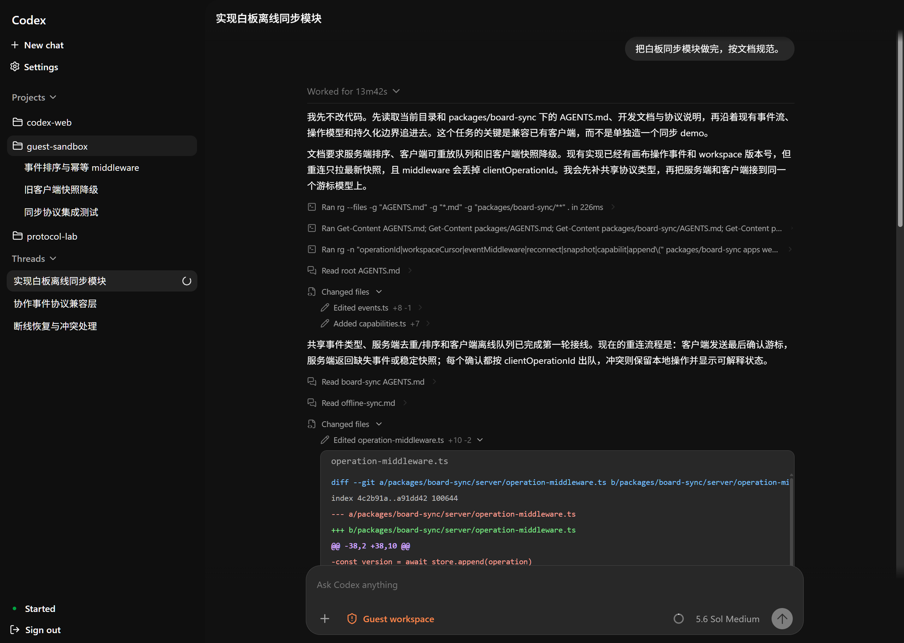
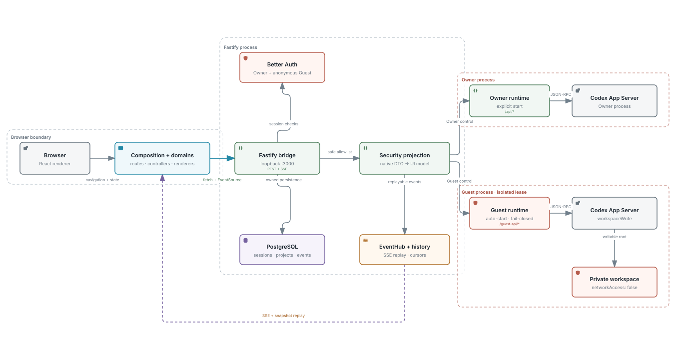

# Codex Web

本地运行的 Codex Web 客户端，可面向个人使用，或对外提供匿名访问。



## 架构

浏览器通过 loopback Fastify bridge 访问 REST/SSE；Owner 与 Guest 使用独立 runtime、credential、workspace 和控制 API。所有会进入浏览器的 Thread、Turn 与事件数据均经过安全投影。



## 开始

需要 Node.js 18+、pnpm；PostgreSQL 可通过 Docker 运行。

```bash
pnpm install
pnpm dev
pnpm server:owner
```

打开 <http://localhost:5173>。

Guest 使用独立服务：

```bash
pnpm server:guest
```

Windows 首次运行 Guest 前执行：

```powershell
.\setup-windows-sandbox.ps1
```

## 常用命令

```bash
pnpm typecheck
pnpm test
pnpm test:frontend
pnpm test:bridge
```

## 文档

- [架构与安全](PROJECT.md)
- [API](docs/api/README.zh-CN.md)
- [前端约定](docs/frontend/README.zh-CN.md)
- [App Server](docs/app-server/README.md)
