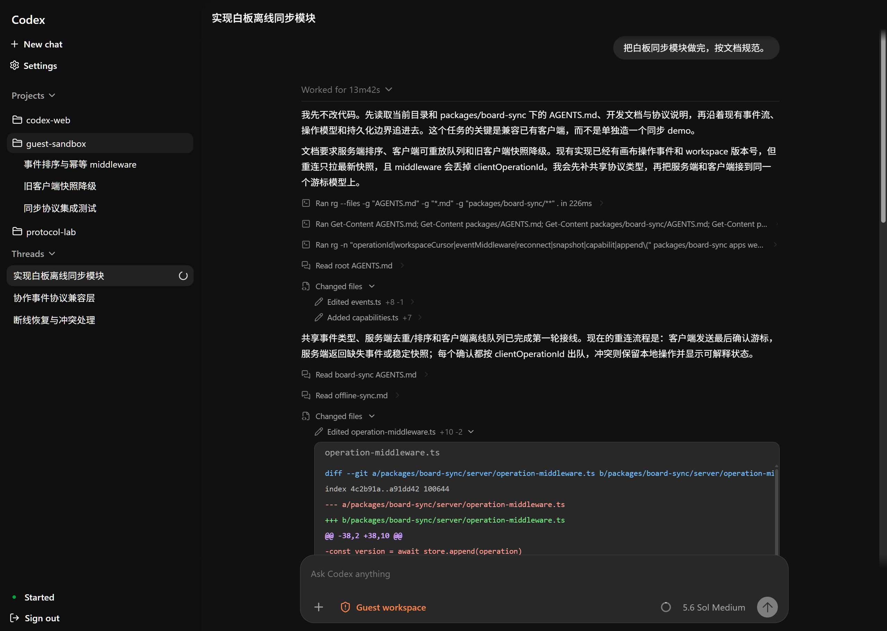
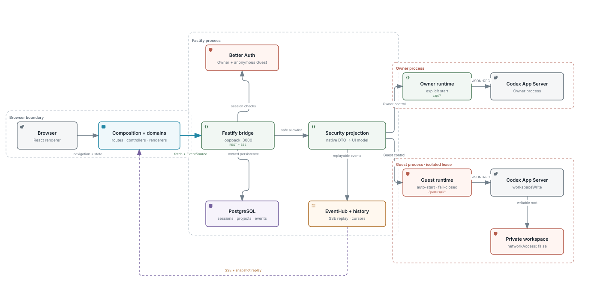

# Codex Web

本地运行的 Codex Web 客户端，可面向个人使用，或对外提供匿名访问。



## 架构

浏览器通过 loopback Fastify bridge 访问 REST/SSE；Owner 与 Guest 使用独立 runtime、credential、workspace 和控制 API。所有会进入浏览器的 Thread、Turn 与事件数据均经过安全投影。



## 开始

需要 Node.js 18+、pnpm；PostgreSQL 可通过 Docker 运行。

```bash
pnpm install
pnpm dev
pnpm server:owner
```

打开 <http://localhost:5173>。

使用构建后的 dist 进行本地自托管时，Web nginx 会同时提供静态资源并转发 API/SSE；默认只启动 Owner：

```bash
docker compose up --build
```

打开 <http://127.0.0.1:8080>。Guest 是可选服务，需要时再启动：

```bash
docker compose --profile guest up --build
```

如果宿主机已有 HTTPS 反向代理，将它指向 `127.0.0.1:8080`。通过 `COMPOSE_BETTER_AUTH_URL`、`COMPOSE_BETTER_AUTH_TRUSTED_ORIGINS` 和两个 `COMPOSE_SERVER_*` 变量配置代理模式；nginx 会保留外部代理传入的 `X-Forwarded-Proto`。

Compose 不发布 Owner、Guest 或 Postgres 端口，也不负责证书和公网 HTTPS。未启用 Guest profile 时，Guest API 不可用但 Web 和 Owner 不受影响。

Guest 使用独立服务：

```bash
pnpm server:guest
```

Windows 首次运行 Guest 前执行：

```powershell
.\setup-windows-sandbox.ps1
```

## 常用命令

```bash
pnpm typecheck
pnpm test
pnpm test:frontend
pnpm test:bridge
```

## 文档

- [产品文档](docs/product/README.zh-CN.md)
- [架构与安全](PROJECT.md)
- [API](docs/api/README.zh-CN.md)
- [前端约定](docs/frontend/README.zh-CN.md)
- [App Server](docs/app-server/README.md)
